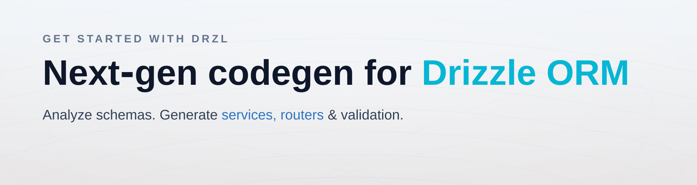

<p align="center">
  
  
</p>

<div align="center">

# DRZL

Zero‑friction codegen for Drizzle ORM. Analyze your schema. Generate validation, services, and routers — fast.

<br/>

<p align="center">
  <a href="https://github.com/use-drzl/drzl/actions/workflows/ci.yml"></a>
  <a href="https://www.npmjs.com/package/@drzl/cli"></a>
  <a href="https://pnpm.io"></a>
  
  
</p>

</div>

## What’s Inside

- Analyzer: turns Drizzle schemas into a normalized analysis model
- Generators: Zod, Valibot, ArkType validation; typed CRUD services; router templates (oRPC)
- Batteries: formatting, naming, reusable/shared schemas, relation support
- Monorepo: pnpm workspace, lockstep releases with Changesets

## Install & Use

- Install the CLI and init a config

```bash
pnpm add @drzl/cli -D
pnpm drzl init
```

- Generate code

```bash
pnpm drzl generate -c drzl.config.ts
```

Minimal config

```ts
// drzl.config.ts
import { defineConfig } from '@drzl/cli/config';

export default defineConfig({
  schema: 'src/db/schemas/index.ts',
  outDir: 'src/api',
  generators: [
    { kind: 'zod', path: 'src/validators/zod' },
    { kind: 'service', path: 'src/services', dataAccess: 'drizzle' },
    { kind: 'orpc', template: '@drzl/template-orpc-service' },
  ],
});
```

Runtime

- ESM / ES2021 output
- Node ≥ 18.17 (tested on Node 20+)

## Packages

- `packages/analyzer` — schema analysis
- `packages/cli` — CLI (`drzl`)
- `packages/generator-orpc` — oRPC router generator
- `packages/generator-service` — typed service generator
- `packages/generator-zod` — Zod generator
- `packages/generator-valibot` — Valibot generator
- `packages/generator-arktype` — ArkType generator
- `packages/validation-core` — shared validation utilities
- `packages/template-orpc-service` — oRPC router template (service‑backed)
- `packages/template-standard` — minimal oRPC router template

See each package’s README for details.

## Development

- Install: `pnpm install`
- Build: `pnpm -r run build`
- Test: `pnpm -r test`
- Lint: `pnpm lint`

## Docs

VitePress site lives in `docs/` (kept out of releases). Local dev:

```bash
pnpm -C docs dev
```

## Contributing

Contributions welcome — see [CONTRIBUTING.md](./CONTRIBUTING.md).

## License

Apache-2.0